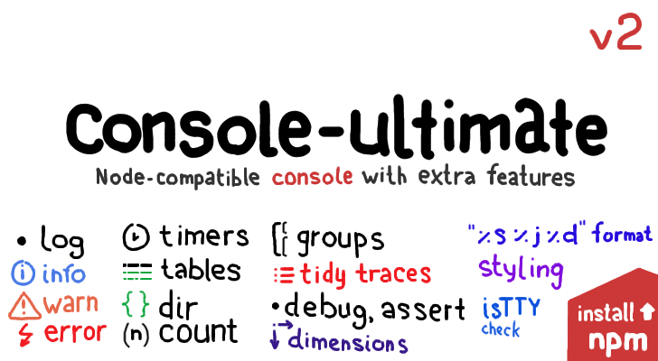

# console-ultimate
[](https://www.npmjs.com/package/console-ultimate)

Node-compatible `console` with extra features. Replace default one with this and you'll have nice styles and advanced features out of the box. Features include: timers, tables, groups, terminal clear, customizable styles and behaviors for every function, on|off flags for every additional function and other.

All Node-related features are enabled by default and can be noop-ed if required. Any additional feature can be easily turned on and customized.

Now all Node-related features is **implemented** and this module can be used as **drop-in** replacement for **standard console**.

All **major advanced features**, like tables, grouping, improved stack traces and customizing **are implemented too**. Some things still should have enrichment in options. If you need something special, feel free to [open an issue](https://github.com/StreetStrider/console-ultimate/issues).


## install
```sh
npm install console-ultimate
# or
npm install StreetStrider/console-ultimate
```


## usage
### instantiate

```javascript
var Console = require('console-ultimate');
var console;

console = new Console(process.stdout, process.stderr);
// or:
console = Console(process.stdout, process.stderr);
// or just (if default std streams):
console = Console();

console.log('...');
```

The third parameter can be used to pass any options.
```javascript
Console(stdout, stderr, options)
```

For compability with Node you must pass stream arguments before options. If you want them point to std, you can pass `null` instead.


### styling
`Console.colors` and any console instance `.colors` property is a ref to [cli-color](https://github.com/medikoo/cli-color). It can be used for customizing output styles.

```javascript
console = Console(null, null, {
  styling: {
    log: {
      color: console.colors.bold
    }
  }
});

console.log('...'); // output is bold now
```


### patch global console
```javascript
require('console-ultimate/global').replace();
```
`global.console` is replaced with `console-ultimate` instance.

### features
Addtional features are managed by feature-gates. All features are enabled by default, but can be turned off or tuned.
```javascript
console = Console(null, null, {
  features:
  {
    debug: false, /* disable `debug` alias */
    // clear: true, /* feature is enabled by default */

    timer:
    {
      // hrtime: true /* tune timers to use hi-precision time */
      // enabled by default
    }
});
```

### examples
You can find feature-by-feature examples in `examples/` directory.


## todo
Most of the needed features have been implemented. If you need something special, [open an issue](https://github.com/StreetStrider/console-ultimate/issues). If you want to use this module extensively, but also want to be sure that everything is ok, we can work on tests together.

* features:
  * [x] log, info, warn, error
  * [x] dir
  * [x] clear
  * [x] count
  * [x] debug
  * [x] time, timeEnd
    * [x] hrtime (with [pretty-hrtime](https://github.com/robrich/pretty-hrtime))
    * [x] retrieve
  * [x] trace
    * [x] better stack traces ([trace](https://github.com/AndreasMadsen/trace) + [clarify](https://github.com/AndreasMadsen/clarify))
  * [x] assert
  * [x] table
    * [x] table with 2nd argument
    * [ ] advanced styling
  * [x] group, groupEnd
  * [ ] logger partials
  * [ ] dir, retrieve (inspect)
* options & feature gates:
  * [x] colors: `true | false |'tty'`, advanced styling
  * [x] works properly if redirected to pipe or file (check for TTY)
  * [x] mapping method → stream (stdout or stderr or custom stream)
  * [x] per-method feature gates
  * [x] custom prefixes
* console variations:
  * [x] console/global — replace global `console` with `console-ultimate` instance
  * [ ] console/global-patch - patch global `console` to make all functions, captured old `console` work with `console-ultimate`
  * [ ] console/proxy — proxy calls to another console instance
  * [ ] null-console — silent console
* [ ] browserify-noop (return standard browser console)
* [ ] tests
* [ ] remote consoles, node-inspector integration (research)

# license
MIT, copyright © 2015 StreetStrider.
