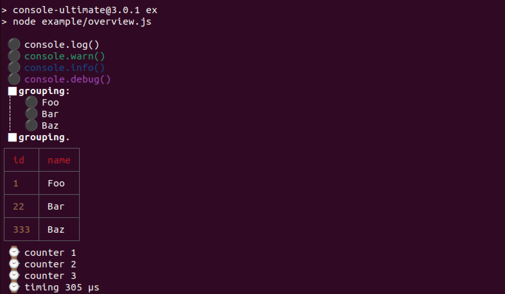
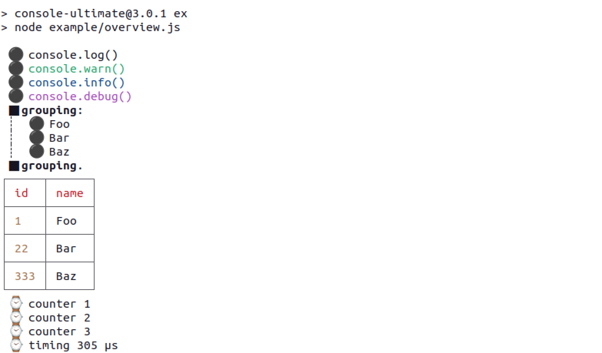

<p align='center'>
  <a href='https://www.npmjs.org/package/console-ultimate'>
    
  </a>

  <a href='#license'>
    
  </a>
</p>

<p align='center'>
  <a href='https://www.npmjs.org/package/console-ultimate'>
    
  </a>
</p>

# What's this?
This is an opinionated console for Node with some default styling and additional features.
The main focus is to be Node-compatible console with more pretty look and feel.
There's also some additional features.
Turn it on with one line and get all the benefits at once.

<table>
  <tr>
    <td></td>
    <td></td>
  </tr>
</table>

# What's included?
* Fully Node-compatible API. So **console-ultimate** can replace **`console`** globally.
* Nicely looking `log`, `info`, `warn`, `error`. They are colored, so more distinctive in terminal.
Also some unicode decorations included.
* Better stack traces and overall `error` formatting. Stack trace is cleared from internal entries (`console.error`, `console.trace`).
* Nice grouping (`console.group`) with visual indentation and pseudographics.
* `console.table` with adequate table width, including ansi-colored things, nice borders and colors.
* FP-friendly loggers that can passthrough value, so they can be used in pipes (`.then`, `.map` etc…).
* All other stuff, like `console.count` and `console.time`.
* Deprecated methods are also supported for compability (`console.debug`, `console.dirxml`).

# Differences between v3 and v4
By the time of v3 the package was implemented with the help of transitional package called [esm](https://www.npmjs.com/package/esm). The package, in fact, CJS, but uses this package for sugars and as an experiment with early ESM syntax.

v4 is a direct upgrade to standard [ESM](https://nodejs.org/api/esm.html) with the same functionality and modern dependencies.

Both versions provide [export maps](https://nodejs.org/api/packages.html#package-entry-points).

# Install
```
npm i console-ultimate
```

# Turn on

```js
/* replace console instance globally */
import 'console-ultimate'

/* get instance with default options AND replace globally */
import console from 'console-ultimate'

/* get instance with default options (NOT replacing global instance) */
import console from 'console-ultimate/default'

/* upgrade global instance with certain options */
import upgrade from 'console-ultimate/upgrade'

/* upgrade */
upgrade({ stdout })

/*
  instantiate your own custom instance
  via `Console`, a Node-compatible constructor */
import Console from 'console-ultimate/Console'

let console = Console({ stdout })

console.log(console)
```

# Things to be done
* Turn coverage on.
* Better `thru` and `partial`.
* Retrieve (get formatted string instead of writing to stream).
* Advanced dir flags (like `hidden` & `noinspect`). (https://nodejs.org/api/util.html#util_util_inspect_object_options)
* Table props.
* `ignoreErrors`
* `debug`-like API with sub-instantiating, creating sybsystem-wise consoles.
* enable/disable instance.
* Proxy console.
* Browser-friendly.
* node-inspector integration.

# License
ISC, © 2023 Strider.
